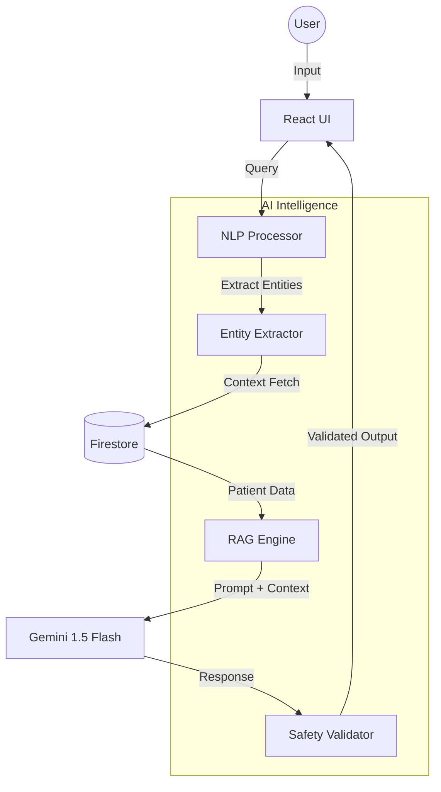

# Phase 2: AI Health Coach & Clinical Intelligence (Technical Specification)

## 1. Overview

Phase 2 transforms the clinical telemetry platform from a passive data viewer into an active intelligence engine. This phase focuses on Retrieval-Augmented Generation (RAG), conversational AI, and multi-user family management.

## 2. Architecture Diagram (Mermaid)

## 3. Feature 1: AI Health Coach (Personalized Insights)

### 3.1 Core Capabilities

- **Conversational Queries**: Users can ask natural questions like "How has my fasting glucose trended over the last 6 months?"
- **Context-Aware Recommendations**: AI analyzes lab values + current medications + chronic conditions to suggest lifestyle modifications.
- **Predictive Risk Assessment**: Using historical trends to identify potential cardiovascular or metabolic risks before they reach clinical thresholds.
- **Medication Side-Effect Analyzer**: Analyzes patient symptoms against known side effects of their specific medication regimen.

### 3.2 Implementation Strategy

- Use `@google/genai` with System Instructions centered on clinical guidelines (AHA, ADA, ACC).
- Implement a "Context Window" that injects the last 20 lab results and current active medications into every prompt.
- **Safety Guardrails**: Strict "Do not diagnose" and "Consult doctor" instructions embedded in the system prompt.

## 4. Feature 2: Natural Language Processing (NLP) & Voice

### 4.1 Voice-to-Action

- Integration with Web Speech API for hands-free queries.
- Voice-enabled navigation ("Show me my lipid panel").

### 4.2 Doctor Note Synthesis

- Processing unstructured "Doctor Notes" to extract follow-up actions and appointment requirements.
- Multi-language support for report extraction.

## 5. Feature 3: Family Health Management

### 5.1 Multi-Profile Architecture

- Parent/Child/Dependent profile relations in Firestore.
- Granular permissioning (Read-only for caregivers, Full-access for primary).

### 5.2 Genetic Risk Aggregation

- Identifying patterns across family members (e.g., shared early-onset hypertension markers) to provide proactive screening alerts.

## 6. Implementation Timeline

### 6.1 Phase 2.1: Foundation (Weeks 1-4)

- Development of the RAG engine.
- Implementation of the `HealthCoach` chat components.
- Initial clinical safety audit.

### 6.2 Phase 2.2: Advanced NLP (Weeks 5-8)

- Voice integration.
- Doctor note processing.
- Multi-language report support.

### 6.3 Phase 2.3: Family & Collaboration (Weeks 9-12)

- Multi-profile management systems.
- Genetic risk visualization.
- Final production hardening and E2E testing.

## 7. Tech Stack & Dependencies

- **LLM**: Gemini 1.5 Flash
- **State Management**: React Context + Firestore Real-time listeners
- **Voice**: Web Speech API
- **NLP**: Custom entity extraction via Gemini function calling
- **Security**: Firebase Identity Platform + Custom Security Rules

## 8. Safety & Compliance

- **PII Isolation**: Identifying and scrubbing names from AI prompts where possible (using UID mapping).
- **Disclaimers**: Mandatory persistent clinical disclaimers on all AI-generated text.
- **Emergency Escalation**: Detection of urgent keywords ("chest pain", "fainting") triggers immediate local medical contact prompts.
